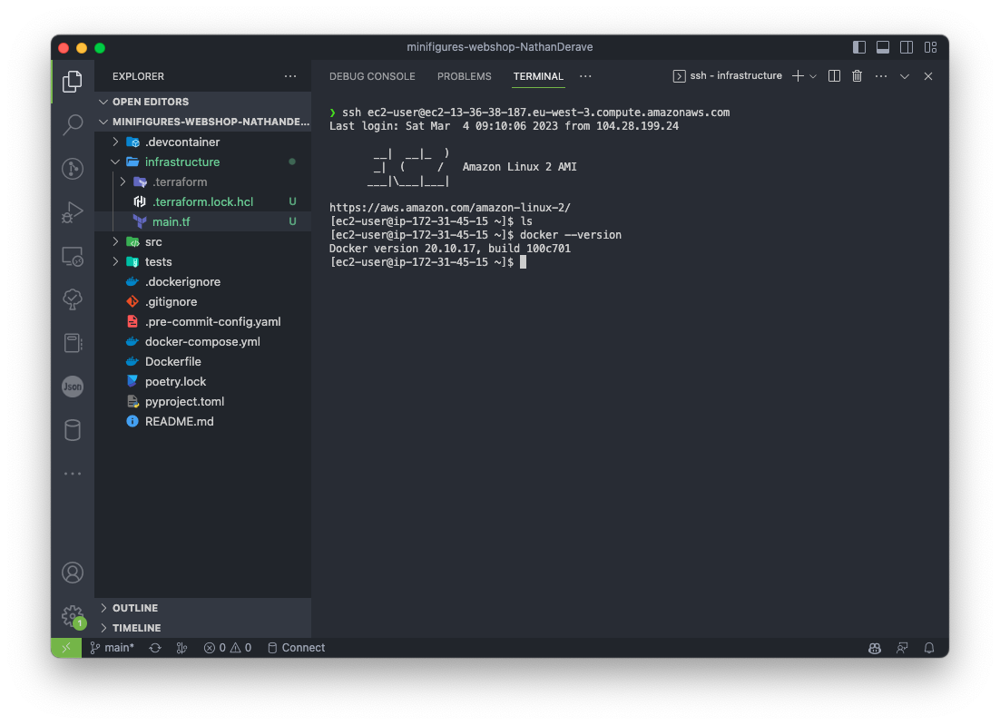
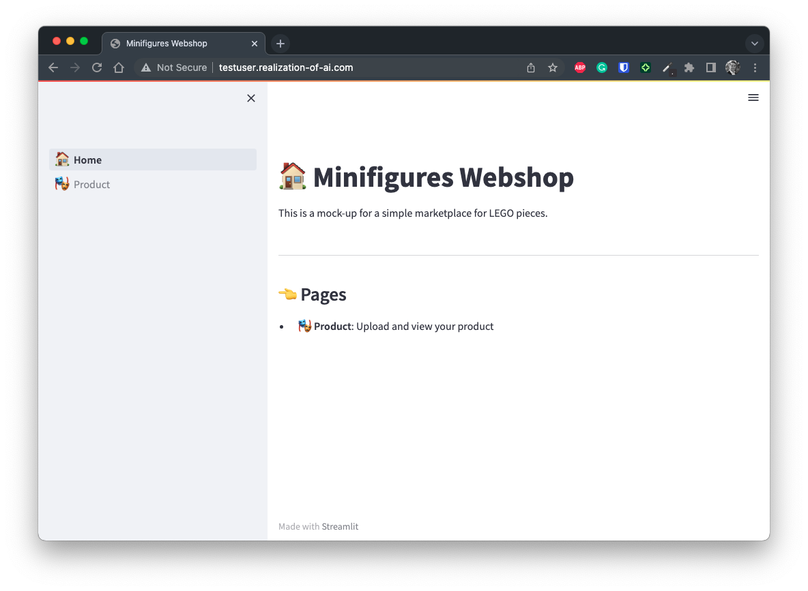

# How to run your application in the Cloud?

This guide will help you to run your application in the Cloud leveraging the results of the IaC 
[Terraform deployment you did in the dedicated section](./terraform_get_started.md) of this documentation.
In this course, we will use AWS as a Cloud provider and more specifically, we will use the EC2 service
which is a virtual machine service. We will also use the S3 service to store our application artifacts 
(your ML models).

In this guide, we will consider that the `student-stack` module you deployed in the previous section
returned the following outputs:

```
domain_name = "testuser.realization-of-ai.com"
ec2_instance_id = "i-0df6b71ce1e72fa39"
ec2_instance_public_dns = "ec2-13-36-38-187.eu-west-3.compute.amazonaws.com"
ec2_instance_public_ip = "13.36.38.187"
ecr_repository_url = "516454187396.dkr.ecr.eu-west-3.amazonaws.com/testuser"
s3_bucket_name = "testuser-kulroai-bucket"
```


## Push your Docker image to ECR.

Before being able to run your application Docker image on your EC2 instance, you need to build it and
push it to your ECR repository. To do so, the only thing you need to know is related to how you name
your image at building time. Indeed, you need to tag your image with the URL of your ECR repository.

For example, if your ECR repository URL is `516454187396.dkr.ecr.eu-west-3.amazonaws.com/testuser` as
shown in the Terraform outputs, you will need to run the following command to build and publish your image:

```bash
# From the root of your repository:
# Login Docker to your ECR registry using the aws CLI
aws ecr get-login-password --region eu-west-3 | docker login --username AWS --password-stdin 516454187396.dkr.ecr.eu-west-3.amazonaws.com

# Build and push your image using the registry name
docker build -t 516454187396.dkr.ecr.eu-west-3.amazonaws.com/testuser:latest .
# Depending on the environment you may possibly prepend build command with DOCKER_BUILDKIT=1 statement
# DOCKER_BUILDKIT=1 docker build -t 516454187396.dkr.ecr.eu-west-3.amazonaws.com/testuser:latest .
docker push 516454187396.dkr.ecr.eu-west-3.amazonaws.com/testuser:latest
```

Once done, you should be able to observe your Docker image in your ECR registry:
```
aws ecr describe-images --region eu-west-3 --repository-name testuser
```

You can also use the AWS console to check that your image is available in your ECR repository:


## Push your dependencies to your S3 bucket.

In this course, we will use the S3 service to store our application artifacts (your ML models). To do 
so, you can run from your Codespace/laptop containing the ML models binaries (in a `models` folder) 
the following command:

```bash
# From the root of your repository:
aws s3 cp ./models s3://<your-S3-bucket-name>/models --recursive
```

The command above will copy the `models` folder to the `models` folder in your S3 bucket. Thanks to 
the `--recursive` flag, all the files contained in the `models` folder will be copied to your S3 bucket.
Make sure you read the documentation and tailor your command to your needs.

## Connect to your EC2 instance.

To connect to your EC2 instance, you can use either the `ec2_instance_public_dns` or the `ec2_instance_public_ip`
outputs of your Terraform deployment. In this example, we will use the `ec2_instance_public_dns` output.
You can connect using the `ssh` command:

```
ssh ec2-user@ec2-15-188-119-232.eu-west-3.compute.amazonaws.com
```

You may be asked to confirm the authenticity of the host at first connection. Just type `yes` and 
press <kbd>ENTER</kbd>. Once connected, you should see something like this:



At this point, you are connected to your EC2 instance. You can now run your application using `docker`.

## Run your Docker image on your EC2 instance.

Now your image is available in your ECR repository and your dependencies are available in your S3 bucket,
you can run your application on your EC2 instance. To do so, you need to pull your image from your ECR
registry and run it appropriately depending on your implementation. You will also need to pull your 
dependencies from S3. Those can be pass to your application Docker container by using volume mount. 
To do so, you can inspire yourself from the following example commands:

```bash
# On your EC2 instance
sudo su
aws ecr get-login-password --region eu-west-3 | docker login --username AWS --password-stdin 516454187396.dkr.ecr.eu-west-3.amazonaws.com
docker pull 516454187396.dkr.ecr.eu-west-3.amazonaws.com/testuser:latest

# Pull your dependencies from S3
aws s3 cp s3://<your-S3-bucket-name>/models ./models --recursive

# Create a Docker network for your containers to be able to communicate
docker network create kulroai-net

# Run the API (and mount the models folder as a volume in the /app/data/models folder of the image)
docker run \
-d \
--rm \
--network kulroai-net \
--name api \
-v $(pwd)/models:/app/data/models \
-p 8000:8000 \
516454187396.dkr.ecr.eu-west-3.amazonaws.com/testuser:latest \
api

# Run the Streamlit app 
docker run \
-d \
--rm \
--network kulroai-net \
--name app \
-p 80:8500 \
516454187396.dkr.ecr.eu-west-3.amazonaws.com/testuser:latest \
app
```

A few notes about the commands above and the EC2 environment:

* the security group associated to your EC2 instance is configured to allow only SSH, HTTP, 
  and HTTPS connections. It means that out of the port 22 dedicated to SSH, you can run your Streamlit 
  application on port 80 (HTTP) and port 443 (HTTPS) only. Your Docker port mapping should be adapted
  as in the example above (mapping from `8500` inside the container to `80` outside the container, which 
  is the hosting EC2 machine one).

* The usage of the Docker network `kulroai-net` allows your containers to communicate with each other. This way,
  knowing that your API container is named `api` and exposed on port `8000`, you can reach it from your Streamlit
  container named `app` under the URL `http://api:8080`. The same applies from `api` to `app` and any other container
  that would be running in the Docker network.

Once done, you can head to your domain name (here `testuser.realization-of-ai.com`) and you should see
your application running live! Congratulations, you just deployed your application in the Cloud! 🎉


